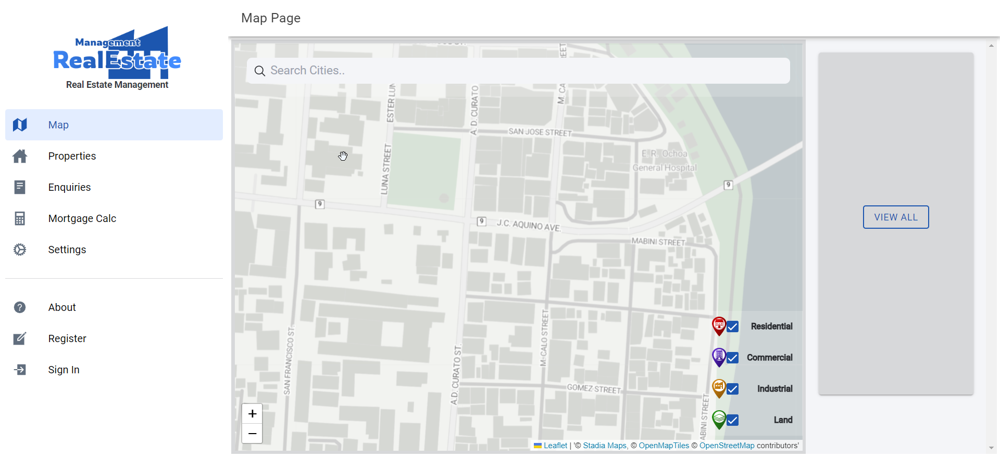
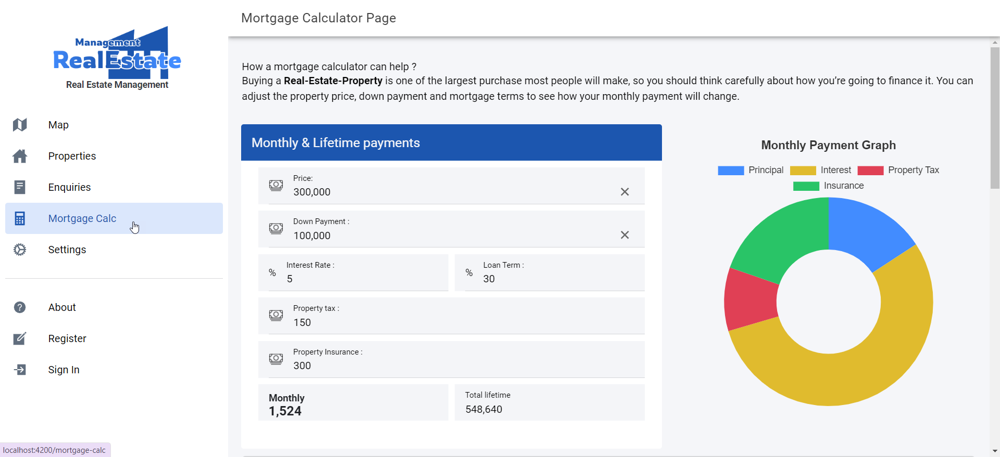

# real-estate-management

A online property management solution for real estate and
physical property management. This can include residential,
commercial, and land real estate. a software developed to
connect property managers and potential buyers.

<p align="center">
  
  
</p>

🚧 **frontend/** work in progress 🚧.


## **Dependencies**

### **Frontend**
- [Ionic 7+](https://ionicframework.com/)
- [Angular 16+](https://angular.io/)
- [leaflet 1.7+](https://leafletjs.com/)
- [chartjs 3.5+](https://www.chartjs.org/)

# **SETUP**

## **Frontend (Part)**

### **1. edit environment.ts file.**

- set values to variables (ex. api.url) 
```
  api: {
    url: 'http://localhost:8000/', <-- server URL
    mapKey: '', <-- Leaflet map key,
    googleAuthClientId: '', <-- google Auth CLient ID for Social signin
    webSocketUrl: 'ws://localhost:8000/websocket' <-- websocket URL
  }
```

### **2. then install dependencies & run ionic serve**

In terminal - command
```
# install dependencies
$ npm install

# serve frontend
$ ionic serve
```

<br>

## Routes
```
/docs/
/users/
/auth/
/properties/
/enquiries/
```
